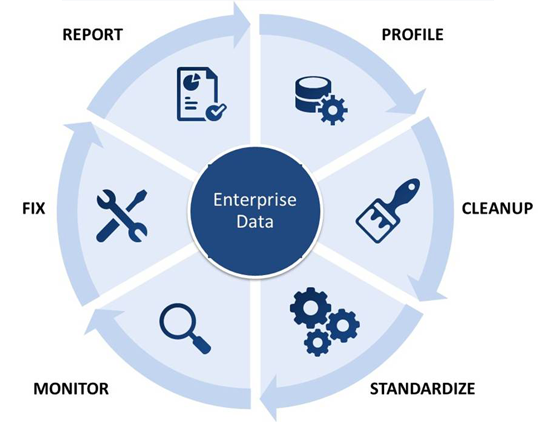
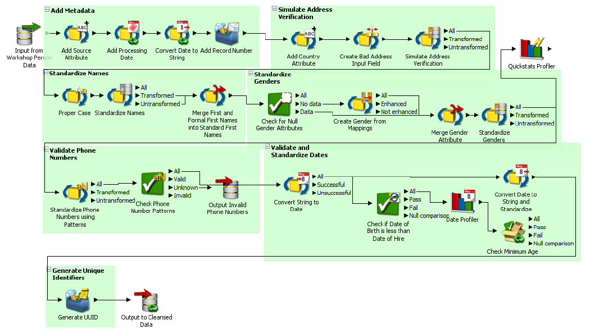

# DATA WRANGLING USING ORACLE ENTERPRISE DATA QUALITY TOOL 
#### Oracle Enterprise Data Quality application is to address data quality needs like profile and audit, parse and standardize,match and merge and address verification.
 
#### Data Quality has been checked for contacts Data in CRM and director package file(.dxi extension file) has all the processors and configuration 
## What the RAW Data contains?
  #### Contacts in CRM has following fields:
  - First Name, Last Name, Suffix, Gender, SSN, DOB, Address(composite field)etc..
  - Possessing inconsistent, missing data for DOB, Address fields etc
  - Duplicate rows existence causing redundancy
## Data Wrangling
 
  - Connected to any specified data Source like MySQl, Oracle, etc
  - Run __Profilers__ and studied statistical measures to understand data
  - Removed Missing and Duplicated contact records
  - __Standardized__ First and Last Names
  - Converted Date fields to proper formats
  - Validated __phone numbers__ using __Reference Data__ concept
  - Validated __Last Names__ using __Reference Data__ concept
  - Validated __Email address__ using Regular expressions
  - Peformed Wrangling using processors like Add String Attribute, Add Numeric Attribute, Concatenate processors
  - Used regular expressions to split merged field into tokens while __parsing__
  - Used __Data Interfaces__ concept to run  multiple data sources through same process
  - Performed Fuzzy Search using __Advanced Match__ Processor configuration(__clustering__ concept) by checking runtime input to backend database field values, then return match score with closely related records
  - Published matching results as Web services
  - Used __Server Console__ to run the processes __dynamically__ using __job__ and __job scheduling__ configuration
  - Processed data is written to output files using __Writer__
