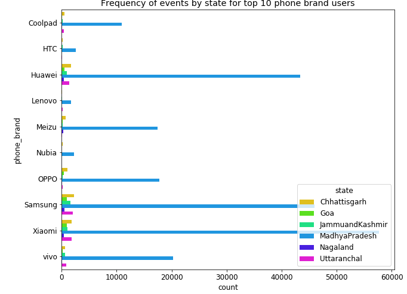

# Consulting assignment on Telecom Service Provider
## SOURCE OF DATA 
  
- The Data is collected from mobile apps that use Mr. XY Telecom services. Full recognition and consent from individual user of those       apps have been obtained, and appropriate anonymization have been performed to protect privacy. 
- The data schema consists of following three tables.
- __gender_age_train__: Devices and their respective user gender, age and age_group
- Shape of gender_age_train is 74645 rows x 4 columns
- __phone_brand_device_model__: device ids, brand, and models phone_brand: note that few brands are in Chinese
- Shape of phone_device_model is 87726 rows X 3 columns
- __events_data__: when a user uses mobile on Mr. XY Telecom network, the event gets logged in this data.
- Each event has an event id, location (lat/long), and the event corresponds to frequency of mobile usage.
- Shape of events_data when filtered for our respective states “Madhya Pradesh, Goa, Chhattisgarh, Nagaland, Null and Uttaranchal” is     261472 rows X 7 columns
## ATTRIBUTE INFORMATION
| Column Name   			| Description                                              		  |
| ------------- 			| --------------------------------------------------------------|                                            		
| age                    | age of user                                   	  | 
| gender        		| gender of user                     				        |  
| device_id          		| Unique id of device belonging to user                                         | 
| age_group       			| age_group of user      							            |                                            
| phone_brand       | Name of phone brand that user is using            |   
| device_model       				| Name of device_model that user is using                                      	|
| event_id 		| Event id of user using mobile at a single instance   |
| Latitude          			| Location column that is latitude value of user’s location when using mobile                       |
| Longitude          				| Location column that is longitude value of user’s location when using mobile                 |
| Timestamp    				| When user is using mobile                   |
| City				| Where user is using mobile 	|
| State 				| Where user is using mobile	| 
## DATA WRANGLING
- Fetched 'Null' state records from database.
- Based on device_id, updated state, latitude,longitude,city columns appropriately without discrepancies. 
- Checked for latitude and longitude containing "0" values and updated them with appropriate values based on device_id.
- Checked for incorrect values for latitude and longitude, updated them with correct values based on device_id.
- Fetched device_id containing value 0 records and updated them by latitude,longitude values. 
- Merged gender_age dataframe and events_ data dataframe and found no null records.
- Merged phone_brand_device_model dataframe with already above merged dataframe.
- There are NaN's for phone_brand,device_model columns in merged dataframe.
- These NaN's are filled by mode values from merged dataframe.
- Our dataset is cleansed and ready for performing analysis and plotting with __261182 rows X 12 columns__
- Unique device_id’s which represent individual user count is __4297 rows X 12 columns__
- After filtering for __top 10 phone brand users__, we get events recorded count as __246400 rows X 12 columns__, whereas unique device_id’s count is __4061 rows X 12 columns__ 
## PROBLEM STATEMENT
- To help the customer, the consultants are expected to have depth of clarity in the underlying data. Do help the service provider understand what the right way forward is and suggest actionable insights from marketing and product terms.
## PROBLEM ANALYSIS - EDA

 
## INSIGHTS- CONSULTING REPORT
 
- [Link for Consulting Report](https://github.com/suvarchalasarva/EDAandMLwithPython/blob/master/EDA%20on%20Telecom%20Services/ConsultingReport.docx)
## CONCLUSION
Consulting Team provides Insights reports to customers and help understand them by numbers, how their Telecom Services have impact on users by their demographic, location features. Next customers will get to know what decision they can make in order to increase, the usage of their telecom users in respective cities, states and do more marketing in specific cities respective to age groups, genders and like other features. (Which brand users are more compatible to their services).

