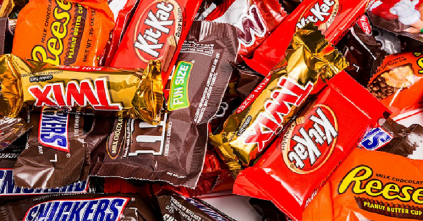

# HALLOWEEN CANDY WINPERCENT
## DATA
  
- This dataset was scraped from __Five Thirty Eight-Candy__ Power Ranking Dataset.
- It is collection  of multiple candies records with specifications like flavors(chocolate,caramel,peanutyalmondy,etc), sugar percent   contained them
- Data was collected by creating a website where participants were shown presenting two fun-sized candies and asked to click on the one they would prefer to receive. In total, more than __269 thousand votes__ were collected from 8,371 different IP addresses.
- Dataset contains __85__ entries and __13__ columns/variables
- __3__ Numeric , __1__ Categorical and __9__ Boolean variables 
## ATTRIBUTE INFORMATION
| Column Name   			| Description                                              		  |
| ------------- 			| --------------------------------------------------------------|                                            		
| competitor Name     | Name of competitor brand                                   	  | 
| chocolate        		| Does it contain chocolate?                     				        |  
| fruity          		| Is it fruit flavored?                                         | 
| caramel       			| Is there caramel in the candy?      							            |                                            
| peanutalmondy       | Does it contain peanuts, peanut butter or almonds?            |   
| nougat       				| Does it contain nougat?                                      	|
| crispedricewafer 		| Does it contain crisped rice, wafers, or a cookie component   |
| hard          			| Is it a hard candy?                                  			    |
| bar          				| Is it a candy bar?                                            |
| pluribus    				| Is it one of many candies in a bag or box?                    |
| sugarpercent				| The percentile of sugar it falls under within the data set  	|
| pricepercent 				| The unit price percentile compared to the rest of the set 	  |
| winpercent				  | The overall win percentage according to 269,000 matchups		  | 
## DATA IN DEPTH
- Number of Entries:     __85__
- Number of Variables:   __13__
- Numeric Variables:     __3__
- Categorical Variable:  __0__
- Boolean Variables:     __9__
- Text Variable:         __1__
- Size in Memory:      __8.7 KiB__
## PROBLEM STATEMENT
- What’s the best (or at least the most popular) Halloween candy(win percent)?
- Which specified features/columns are associated with higher rankings?
- Identify how each feature has effect on other features , study the correlations
Generally, by studying insights from above will help candy manufacturers/makers know what type of flavor is mostly liked by people and they can include those flavors in their candies and make good business

