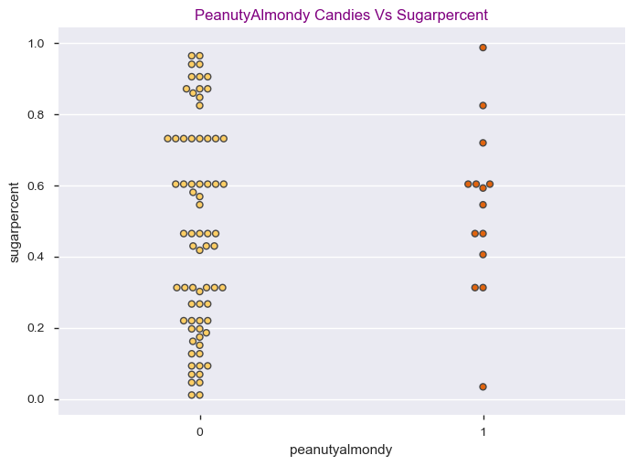
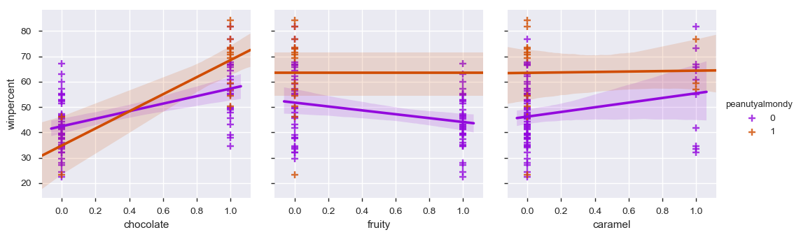
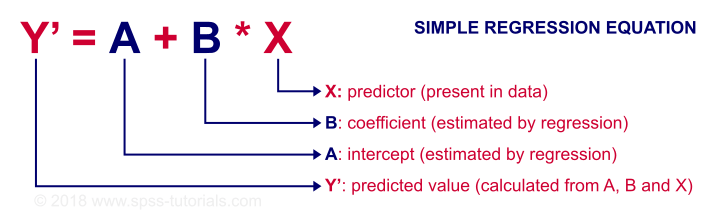

# Consulting assignment on Telecom Service Provider
## DATA
  
- The Data is collected from mobile apps that use Insaid Telecom services. Full recognition and consent from individual user of those     apps have been obtained, and appropriate anonymization have been performed to protect privacy. 
- The data schema consists of follwing three tables.
- gender_age_train: Devices and their respective user gender, age and age_group
- Shape of gender_age_train is 74645 rows x 4 columns
- phone_brand_device_model: device ids, brand, and models phone_brand: note that few brands are in Chinese
- Shape of phone_device_model is 87726 rows X 3 columns
- events_data: when a user uses mobile on Mr. XY Telecom network, the event gets logged in this data.
- Each event has an event id, location (lat/long), and the event corresponds to frequency of mobile usage.
- Shape of events_data when filtered for our respective states “Madhya Pradesh, Goa, Chhattisgarh, Nagaland, Null and Uttaranchal” is     261472 rows X 7 columns
## ATTRIBUTE INFORMATION
| Column Name   			| Description                                              		  |
| ------------- 			| --------------------------------------------------------------|                                            		
| age                    | age of user                                   	  | 
| gender        		| gender of user                     				        |  
| device_id          		| Unique id of device belonging to user                                         | 
| age_group       			| age_group of user      							            |                                            
| phone_brand       | Name of phone brand that user is using            |   
| device_model       				| Name of device_model that user is using                                      	|
| event_id 		| Event id of user using mobile at a single instance   |
| Latitude          			| Location column that is latitude value of user’s location when using mobile                       |
| Longitude          				| Location column that is longitude value of user’s location when using mobile                 |
| Timestamp    				| When user is using mobile                   |
| City				| Where user is using mobile 	|
| State 				| Where user is using mobile	| 
## DATA IN DEPTH
- Number of Entries:     __85__
- Number of Variables:   __13__
- Numeric Variables:     __3__
- Categorical Variable:  __0__
- Boolean Variables:     __9__
- Text Variable:         __1__
- Size in Memory:      __8.7 KiB__
## PROBLEM STATEMENT
- What’s the best (or at least the most popular) Halloween candy(win percent)?
- Which specified features/columns are associated with higher rankings?
- Identify how each feature has effect on other features , study the correlations
- Generally, by studying insights from above will help candy manufacturers/makers know what type of flavor is mostly liked by people and they can include those flavors in their candies and make good business
## EDA

 
## Using Predictive Modelling Technique(Linear Regression)
Our Dataset's target variable is __winpercent__ and is continuous numeric variable, so we use __Linear Regression Machine Learning Model__ to predict winpercent of __any flavored candy__ and __combination of different flavored candies__  

 
#### Studying the featured columns and interpreting their coefficients, we get to know how each feature is effecting the target variable __winpercent__
- __caramel,hard,bar,pluribus,crispedricewafer__ candies contribute to __low winpercents__ and hence we drop those features by studying metrics(as well as correlated variables)
- Before doing feature selection __RMSE__ for the test dataset was __12.252__
- After discarding __'hard','bar','caramel','pluribus','crispedricewafer'__ columns, RMSE comes to be __10.566__
 
## INSIGHTS
 
- Top winpercent candies having high winpercent __84.180,81.866__ are __Reeses Peanut Butter, Reeses Miniature__ contain following flavors
     __chocolate, caramel,peanutyalmondy,not hard, not bar__ candies
- Least winpercent candies 22.44,23.41 are __Nik L Nip,Boston Baked Beans__ have following flavors
     __fruity,pluribus,peanutyalmondy__
- __chocolate, fuity, peanutyalmondy, nougat__ are Independent variables contributing to good winpercents
- Most of the __hard candies are not liked by people__, all hard candies are non bar candies have less winpercents
